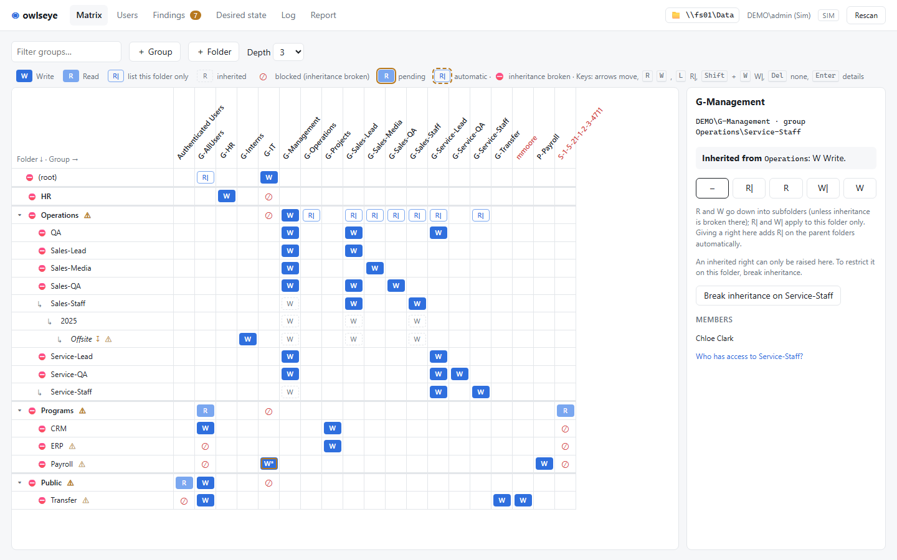
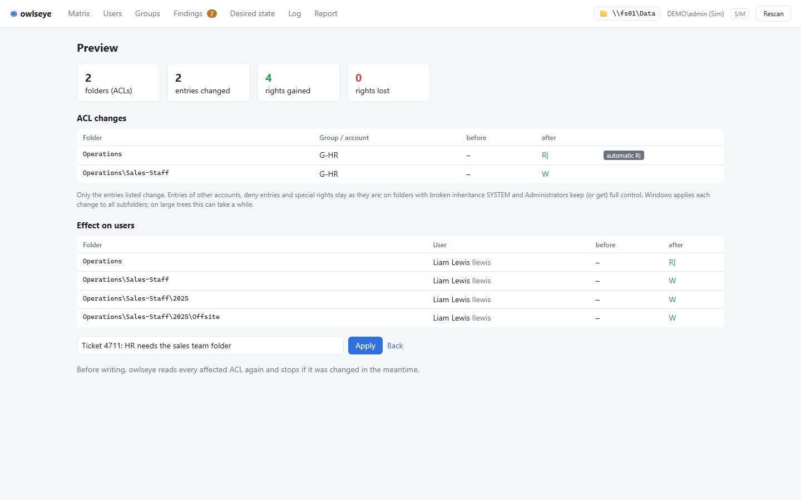

# OwlsEye - Orbit Access Matrix

Owl's-eye view of Windows file shares: rights matrix for NTFS shares, sibling of [birdseye](https://github.com/styliteag/birdseye). The matrix replaces the usual hand-kept Excel list of folder rights: folders (levels 0–3, as a tree) × groups, one cell is the group's ACL entry on the folder. Set rights by click or keyboard, break/restore inheritance, create subfolders, preview the effect at user level, apply with conflict check, log with undo, desired/actual comparison.

The tool runs **in the context of the signed-in admin**. It has no rights of its own, no service account and stores no passwords. It only writes ACLs (and creates folders); the admin keeps maintaining groups and their members in AD, owlseye only reads them. The UI is English.





**Access rights report** (menu "Report"): the share's rights as evidence for audits, as PDF (printed page) and as Excel
workbook (matrix, one row per user and folder with the groups it comes through, groups and members, findings, the
changes of the last 90 days).

What it does for the admin, story by story with more screenshots: [docs/user-stories.md](docs/user-stories.md).

## Rights model

User → security group (e.g. universal) → folder ACL. A group may appear on any number of folders. Matrix columns are all accounts that occur in the share's ACLs, except the hidden ones (SYSTEM, Administrators, Creator Owner, Domain Admins, Enterprise Admins and those listed under `hidden` in config.json); further groups are fetched from the directory via "＋ Group".

| Cell | ACL entry | as in a typical Excel list |
| --- | --- | --- |
| `R` | Read, execute (`0x1200A9`), this folder + subfolders + files | `R` |
| `W` | Modify (`0x1301BF`: read, execute, write and delete), this folder + subfolders + files; with `"write": "no-delete"` in config.json read + write without delete (`0x1201BF`) | `W` |
| `R\|` | Read this folder only (list, to reach subfolders) | `R\|` |
| `W\|` | The same as `W`, this folder only | `W\|` |
| `F` | Full control (`0x1F01FF`), this folder + subfolders + files: also change permissions and take ownership; for admin and service groups (a finding marks it) | |

The masks live in one place (`src/Owlseye.Core/Model.cs`: `M.Read`, `M.Write`, `M.Standard`). Other entries (write without delete while W means Modify, several entries of one group, special rights) show as `*` (special entry), and the cell panel says in Windows terms what is there, e.g. "Modify + change permissions". A click replaces a special entry with the standard entry; if that removes rights the matrix does not show (delete, change permissions, take ownership), the preview lists them before anything is written.

- **R| automatic:** When a group gets a right on a folder, owlseye sets `R|` on every parent folder up to the root that the group cannot otherwise enter. "Enter" means: an own (or inherited) entry there, or every member already gets in via another group (typically `G-AllUsers` with `R|` on the root). When the last right below goes away, this `R|` goes too. An `R|` set by hand stays. Missing `R|` is a finding.
- **Inheritance** (`[-]` in the Excel list, `⛔` in the matrix): `R`/`W` pass into subfolders until one is protected; `R|`/`W|` do not. Toggle on any folder except the root. Breaking copies all inherited entries as own entries (nobody loses access), then you remove selectively. Restoring removes explicit copies of what the parent folder inherits. **Clear** resets a folder to the default like a new one: inheritance on, no own entries (deny and special entries go too), the automatically set `R|` above disappears with it.
- **Hidden accounts:** SYSTEM, Administrators, Creator Owner, the domain's Domain Admins (RID 512) and Enterprise Admins (RID 519), whatever their name in the domain's language, and the accounts listed under `hidden` in config.json (by SID, `DOMAIN\name` or `name`) are no columns; owlseye leaves their entries alone. When writing a protected folder (and the root), owlseye makes sure the accounts of `full_control` have full control, by default SYSTEM and Administrators (the file server's own group); if that is missing anywhere, it is a finding. Shares that use the Domain Admins instead set `"full_control": ["SYSTEM", "Domain Admins"]`. Creator Owner stays unchanged.
- **What owlseye does not touch:** deny entries, entries of other accounts on a changed folder, ACLs with other ACE types (e.g. conditional), paths across junctions/symlinks.

## Structure

A native Windows app: one process, no web server, no Electron. C# on .NET 10, WPF window with Blazor Hybrid
(the pages are Razor components rendered in WebView2 and call the logic directly).

```
src/Owlseye.Core/        platform-neutral logic (net10.0, runs and is tested on any OS)
  Model.cs                 snapshot: folders with ACEs, accounts in the ACLs, groups, users; masks
  Rights.cs                cells from ACEs, inheritance, effective user rights, blocked, findings
  Acl.cs                   explicit ACL of a folder: set cell, break/restore inheritance; create subfolders
  Planner.cs               changeset -> ACL operations per folder (with automatic R|) + effect per user
  Baseline.cs, Drift.cs    desired state (desired-<share>.json) and desired/actual comparison
  Audit.cs                 audit.jsonl, append-only with file lock
  State.cs, Launch.cs      session state, start rules
  Ui/Session.cs, Views.cs  what the pages show and do (the former HTTP routes), testable without UI
  Providers/               AdProvider (logic over the ports), Demo, Sim (emulated AD + real folder tree), LDAP filter
src/Owlseye.Windows/     Win32 adapters (net10.0-windows): DACLs via handle chain, SID lookup, ADSI, local SAM, local seed
src/Owlseye.App/         the exe: WPF window, Razor pages and panels, wwwroot (CSS, keyboard script) embedded
tests/Owlseye.Tests/     xUnit port of the Python tests (any OS)
tests/Owlseye.Windows.Tests/  integration tests against real NTFS ACLs and the local user database (no admin needed)
docs/                    user stories (with screenshots), ADR 0001 (why C#), the requirements spec of the port
tools/screenshots.mjs    regenerates docs/screenshots from the demo data (node tools/screenshots.mjs publish/owlseye.exe)
```

The Python/Electron proof of concept this was ported from is not part of this repository.

Data stays compatible with the PoC: `settings.json` in `%LOCALAPPDATA%\owlseye`; `desired-<share>.json` and
`audit-<provider>.jsonl` in the state folder, by default `%LOCALAPPDATA%\owlseye` too (Settings, config.json `state`). The browser profile of the window lives in
`%LOCALAPPDATA%\owlseye\WebView2`, unexpected errors go to `%LOCALAPPDATA%\owlseye\error.log`.

## Running

Prerequisites for building: .NET 10 SDK. To run: Windows 10/11 or Windows Server with the Microsoft Edge WebView2
Runtime. Windows 10/11 and Windows Server 2025 include it; on Windows Server 2019/2022 install it once as administrator,
with the [online installer](https://go.microsoft.com/fwlink/?linkid=2124703) or, without internet access, the
[offline installer (x64)](https://go.microsoft.com/fwlink/?linkid=2124701). If it is missing, owlseye says so at start
and shows these links.

```
dotnet run --project src/Owlseye.App -- --demo            # demo data, in memory
dotnet run --project src/Owlseye.App -- --sim ./sim       # sim in directory ./sim (created from the demo data)
dotnet run --project src/Owlseye.App -- --local E:\Share  # this machine's local groups/users + real ACLs
dotnet run --project src/Owlseye.App -- --config \fs01\Owlseye$\config.json   # against a domain
```

The published exe takes the same arguments: `owlseye.exe --local E:\Share`. Started without a mode (double-click), it
takes `provider` from config.json (given with `--config`, or a `config.json` next to `owlseye.exe`); without one it
works against AD and the file server on a domain member and with this machine's users and folders elsewhere, and asks
for the share if none was opened before. The mode is not remembered; the demo only starts with `--demo` (or from the
link on the start page). `--local` without a path opens the folder opened last; the share
can be switched at runtime (click on the share in the header, with a folder picker). `owlseye.exe --help` lists
everything.

Sim: same logic as on Windows (`AdProvider`) against an emulated AD and file system. `sim/share/` is the share root
(creating or deleting folders takes effect at the next scan); `sim/state.json` holds AD objects with real attribute
names, SIDs and the explicit ACLs. Editing it by hand = simulating a change in Explorer/ADUC.

Local (Windows without domain): same logic against this machine's local groups and users and a local folder. Reading
and writing other people's folders needs administrator rights: the app starts normally (an elevated process cannot see
the admin's mapped drives) and offers **Restart as administrator** in the header in local mode.

```
owlseye.exe seed-local E:\Share    # once, in an admin prompt: demo share as real folders, groups, users, ACLs
owlseye.exe --local E:\Share       # then "Restart as administrator" in the header
```

- The seed creates the demo groups (`G-*`, `P-*`) and disabled test users `owl.<name>`. Nested demo groups are
  flattened (local groups cannot contain groups). Other folders under the root get an empty explicit ACL. It cleans up
  leftovers of the earlier model (groups `DL_FS_*`, old `owl.*` users, `local-nesting.json`).
- Cleanup (admin PowerShell): `Get-LocalUser owl.* | Remove-LocalUser`, the `G-*`/`P-*` groups with
  `Remove-LocalGroup`, then delete `E:\Share`.

Against a real domain: as a normal admin user, **not** "Run as administrator" (otherwise mapped drives are invisible),
with `config.json` (see `config.example.json`) on the admin share, passed with `--config` or placed next to
`owlseye.exe`. Without it, owlseye uses the domain anyway and asks for the share. `share` may be UNC or a drive letter; internally
owlseye always works with UNC. `max_level` (default 3) is the default matrix depth (changeable in the UI);
`scan_depth` limits how deep owlseye reads (default 20; 0 = whole tree). `write` says what `W` means: `"modify"`
(default, read, write and delete, as Windows and most shares use it) or `"no-delete"` (read and write without delete).
`hidden` lists further accounts that are not shown and not touched, e.g. a backup group with full control everywhere:
`"hidden": ["CORP\\backup"]`. `full_control` lists the accounts that must have full control on the root and on folders
with broken inheritance (default `["SYSTEM", "Administrators"]`; also `Domain Admins` in any language, SIDs or names).

`state` is the folder for the desired state and the log (default `%LOCALAPPDATA%\owlseye`; `audit` and `baseline` can
still name other places). All of these except provider and share can be changed on the **Settings** page; every change is logged. It saves to the
config.json in use if it can be written, otherwise to `%LOCALAPPDATA%\owlseye\config.json`, which owlseye reads at the
next start before a config.json next to the exe (order: `--config`, then that file, then the one next to the exe).

### Installing

owlseye needs no installer: download `owlseye-<version>-win-x64.zip` from the
[releases](https://github.com/styliteag/owlseye/releases) (or build the `publish` folder yourself, see below) and
unpack it on the machine. Apart from the WebView2 runtime nothing has to be installed. The exe and the libraries next
to it belong together; to update, replace the whole folder. `SHA256SUMS.txt` next to the zip holds its checksum
(`Get-FileHash owlseye-*.zip`). The exe is not signed yet, so on first start Windows SmartScreen may ask (*More info* →
*Run anyway*).

**Where the folder goes depends on whether owlseye runs elevated:**

- **Not elevated** (against a domain as a normal admin user, the intended way): any folder will do.
- **Elevated** (local mode with *Restart as administrator*, or *Run as administrator*): put the folder where only
  administrators can write, e.g. `C:\Program Files\owlseye` (copy it from an admin prompt). An elevated owlseye loads
  the libraries next to its exe. If the folder is one the user's normal programs can write (Downloads, Desktop, a
  folder in the profile), any of them could replace a library and so run code with administrator rights. owlseye
  checks this at start and otherwise shows *elevated from an unsafe folder* in the header (details in the tooltip).

### Building the exe

```powershell
.\build-windows.ps1
```

Result: the folder `publish\` (about 75 MB): `owlseye.exe`, self-contained (.NET runtime, all managed code and the web
assets inside), plus the six native libraries of WebView2 and WPF next to it. Copy the whole folder; nothing is
extracted at run time. To run owlseye elevated, install the folder where only administrators can write (e.g.
`C:\Program Files\owlseye`), see [Security](#security).
Tests: `dotnet test`. UI smoke test (starts the exe in demo mode and clicks through matrix, preview, apply, log, undo
and the other pages; Node 22+): `node tests/e2e/smoke.mjs publish/owlseye.exe`. CI (`.github/workflows/ci.yml`) runs
the tests and the build on Windows for pull requests and by hand (Actions tab, "Run workflow") and keeps the publish
folder as an artifact; releases are built by `release.yml` (see below), not on every push. The smoke
test is not part of it, because on GitHub's runners WebView2 never opens the debugging port the test drives the window
through (the app itself runs fine there). The smoke test needs that port, which an elevated owlseye refuses;
`tests/e2e/smoke-ci.ps1` runs it as a temporary standard user when started as administrator.

### Releasing

A version tag publishes a release with the zip to download. Run the UI smoke test locally first, CI does not:

```powershell
.\build-windows.ps1; node tests/e2e/smoke.mjs publish/owlseye.exe
git tag v1.0.0          # v1.0.0-rc1 and the like become a pre-release
git push origin v1.0.0
```

`.github/workflows/release.yml` then runs the tests, builds with that version (`.\build-windows.ps1 -Version 1.0.0`,
which also writes `dist\owlseye-1.0.0-win-x64.zip` and `dist\SHA256SUMS.txt`) and creates the GitHub release with
both files and notes generated from the commits since the last tag. If a step fails, there is no release; delete the
tag (`git push origin :v1.0.0`), fix, tag again.

## Matrix

Rows are the folders (tree, top level collapsible), columns the groups. Clicking a cell or a folder opens a
panel on the right: where a right comes from, group members, set right, toggle inheritance, create subfolder.
Keyboard: arrows move, `R`, `W`, `F`, `L` or `|` for `R|`, `Shift`+`W` for `W|`, `Del` for no entry. Inherited rights
can only be raised; to restrict, use "Break inheritance".

| Mark | Meaning |
| --- | --- |
| `W` / `R` filled | entry on this folder |
| `R\|` / `W\|` outlined | entry for this folder only |
| dashed | inherited (panel shows from which folder) |
| `F` | full control (darker) |
| `*` | other special entry (other mask or flags; the panel says what it is) |
| `⊘` | blocked: right on the parent folder does not arrive because inheritance is broken |
| orange outline | pending change; dashed orange: automatic `R\|` |
| `⛔` on a folder | inheritance broken |

**Depth:** owlseye reads the whole tree. The matrix shows the levels up to the configured depth ("Depth" selector in
the toolbar, default `max_level` from config.json, remembered per admin in `%LOCALAPPDATA%\owlseye\settings.json`).
Deeper folders appear only if they have something of their own (entries, broken inheritance, unreadable): italic
with `↧`, their parent folders faded as the way there. There you can remove entries or restore inheritance;
new folders only go down to the depth. Findings report entries and broken inheritance below the depth.

Creating subfolders: in the folder panel, or via "＋ Folder" for the top level. The new folder inherits; rights on it
can be set before applying. Creating cannot be undone automatically.

Before writing, owlseye re-reads every affected ACL (when toggling inheritance also the parent folder's) and
aborts if it changed since the scan. On Windows, `SetSecurityInfo` on a verified chain of handles writes, which propagates inheritance into
the subtree. Required: `WRITE_DAC` on the managed folders, create subfolders down to one level above the matrix depth.

## Desired/actual comparison

owlseye remembers as desired state all cells (group × folder, all scanned levels) and which folders have broken
inheritance. One file per share in the state folder (by default the admin's `%LOCALAPPDATA%\owlseye`): `desired-<share>.json`
(`\\fs01\Data` → `desired-fs01_data.json`). Written under file lock; every apply carries the changed
folders forward. Whatever someone changed outside owlseye (Explorer, icacls, script) appears under "Desired state":

- **Keep current state**: actual becomes desired, with the reason in the log.
- **Restore desired state…**: the desired values enter the matrix as pending changes and go through preview and
  apply. Deleted folders (and missing parent folders) are recreated empty by owlseye, with their desired entries and
  desired inheritance.

The top of the page shows the location and age of the desired-state file; "Delete desired state…" deletes it (even a
broken one), after which the current state counts as desired. Group memberships are not part of the desired state
(AD maintains them). On the very first start owlseye adopts the actual state (log entry `baseline_init`); a desired-state
file from the earlier AGDLP model counts as absent. A broken file disables the comparison; owlseye does not overwrite
it. Several admins: one state folder on an admin share that only admins can write (Settings, or
`"state": "\\\\fs01\\Owlseye$"` in config.json); changing it on the Settings page moves desired state and log there
if the folder holds none yet, or takes over what another admin keeps there.

## Status

| Part | Status |
| --- | --- |
| Rights logic, planner (incl. automatic R\|), conflict check, log, undo, desired/actual | ported 1:1; `dotnet test`: 239 cases (all 166 PoC tests with their parametrized cases, plus start, Razor and primary-group checks), 236 pass, 3 HTTP-only ones are skipped with a reason; 13 more integration tests against real NTFS ACLs |
| Pages and panels | all PoC pages as Razor components, checked in the running app (demo, sim, local) |
| Local provider (SAM + Win32 ACLs) | integration tests against real NTFS ACLs: read/write through the handle chain, junction refusal, conflict check, break/undo, new folders, paths beyond 260 characters |
| Windows adapter (ADSI) | written against `System.DirectoryServices` (incl. member ranges of large groups and primary-group members such as Domain Users), **untested against a domain** (lab spike) |
| Large shares | 2,100 folders × 60 groups: about 100 ms per change, matrix virtualized |
| Scan | Windows/local read 8/4 folders at a time (network latency); same result as the sequential walk (tested) |
| Packaging | exe plus native libraries in one folder, started from there; nothing extracted to `%TEMP%` (tested) |

### Security

A security review of the C# build (2026-10-04) found nothing critical or high; the medium findings are fixed:

- Writes go only to the folder that was scanned: the scan records each folder's identity (read through a handle that
  does not follow junctions), and right before `SetSecurityInfo` owlseye checks identity, explicit entries and
  protection on the same pinned handle. A folder swapped in by a rename, or an ACL changed in the meantime, is not
  written.
- Accounts that come from files (desired state, log) are resolved through the system and shown under their real name;
  unresolvable SIDs get no rights. Desired-state files and log entries must carry SIDs.
- An elevated instance ignores `WEBVIEW2_*` environment overrides (remote debugging, foreign browser) and uses its own
  browser profile, created fresh at each start.
- Only web links leave the window (no `file:`), nothing can be dropped onto it; Explorer is started by full path; LDAP
  uses signing and sealing; `seed-local` only writes into an empty folder or an earlier demo share (`--force` to
  override); CI actions are pinned and read-only.

- Nothing is extracted to `%TEMP%`: the native libraries (WebView2 loader, WPF) sit next to the exe and are loaded from
  there, Windows libraries called by owlseye only from `System32`. Install the folder where only administrators can
  write if owlseye is to run elevated; an elevated owlseye checks its folder and says so in the header (*elevated from
  an unsafe folder*) if anyone else can change it or the libraries in it, e.g. when it was started from Downloads.

Still open:

- The exe is not signed yet.
- **Elevated, the window is only as safe as the user's session.** WebView2 runs its browser process de-elevated on
  purpose, also when owlseye runs as administrator. Programs running unelevated as the same user can therefore reach
  the window's content, and through it the elevated owlseye (Microsoft advises against hosting WebView2 elevated).
  Run owlseye elevated only for the local mode and only as long as needed; against a domain it runs unelevated
  anyway. The clean fix is an unelevated window with a small elevated helper that only writes ACLs.

Known limitation (as in the PoC): owlseye writes through handles, and Win32 always asks for `SYNCHRONIZE` and read
attributes when opening one. A folder whose ACL grants the admin nothing but ownership (implicit `READ_CONTROL`/`WRITE_DAC`)
therefore cannot be rewritten by owlseye; the apply stops with "access denied" and nothing is changed. `icacls` can.

## Next steps

1. Lab spike in a test domain: Windows adapter against a real file server and DC (ADSI search by SID, nested groups).
2. **Verify in the lab over SMB:** does `SetSecurityInfo` inheritance propagation follow junctions or symlinks that a
   user created *inside* the subtree? On local NTFS it does not (it updates the junction object, not its target; test
   `PropagationDoesNotFollowAJunctionOnLocalNtfs`). Until it is confirmed for shares, owlseye refuses to write above
   any link the scan saw.
3. Sign the exe.

## License

Copyright (c) 2026 Stylite AG. OwlsEye is free software under the
[GNU Affero General Public License v3.0](LICENSE) (AGPL-3.0-only): you may use, study, change and pass it on, also
commercially, as long as changed versions you pass on, or offer to others over a network, are again available as source
under the AGPL.

Stylite AG can also offer it under other terms (commercial license) to anyone who does not want the AGPL's obligations.
For that, contributions from outside can only be accepted with a contributor license agreement (CLA) that allows this.

The download contains `LICENSE` and [THIRD-PARTY-NOTICES.txt](THIRD-PARTY-NOTICES.txt) (.NET, WPF, Blazor: MIT;
WebView2 SDK: BSD-style; all compatible with the AGPL).
