# owlseye user stories

What owlseye does for the people who use it, as user stories with acceptance criteria. The numbered requirements
behind them (F-…, S-…, D-…, N-…) are in [spec.md](spec.md); the decision for the native app is
[ADR 0001](adr/0001-native-windows-app-in-csharp.md). Screenshots are made with `node tools/screenshots.mjs` from the
demo data.

**Who:** the *admin* looks after a Windows file share and its rights. They keep groups and members in Active Directory
and replace a hand-kept Excel list of folder rights with owlseye. Everything owlseye reads and writes runs under the admin's
own account: no service account, no stored password.

---

## 1. See who may do what

### 1.1 Rights matrix

> As an admin, I want to see all folders of a share against all groups that have rights there, so that I can tell at a
> glance who may read or write where, as in an Excel list.

- Rows are the folders as a tree (root, levels down to the chosen depth); columns are the accounts in the ACLs, without
  SYSTEM, Administrators, Creator Owner and Domain Admins (F-M1, F-M3).
- "Hidden accounts" shows SYSTEM, Administrators, Domain Admins and the accounts hidden in the settings as columns
  that can be set too; remembered per admin, no new scan (F-M11).
- A cell shows `R`, `W`, `R|`, `W|` (own entry), a dashed value (inherited), `⊘` (blocked by broken inheritance) or
  `*` (an entry that is not one of the standard entries), `F` for full control (F-M5).
- Top-level folders can be collapsed, columns filtered by name (F-M4, F-M6).
- The depth (1–10) is remembered per admin; deeper folders appear only where they have something of their own (F-M2).
- A share with 2,000 folders and 60 groups stays responsive: a change shows in about 100 ms (N-2).

### 1.2 Where does a right come from?

> As an admin, I want to click a cell and see where the right comes from and who is in the group, so that I understand
> why someone has access before I change anything.

- The cell panel says "Entry here", "Inherited from <folder>", "Blocked" or "No access", and lists the group's members
  (nested groups resolved, also members through the primary group such as Domain Users) (F-E5, F-R5, F-R7).
- "Who has access to <folder>?" leads to the folder page (F-V2).

### 1.3 What can one user reach?

> As an admin, I want to pick a user and see every folder they can reach and through which groups, so that I can answer
> "why can Emma open this?" without clicking through properties dialogs.

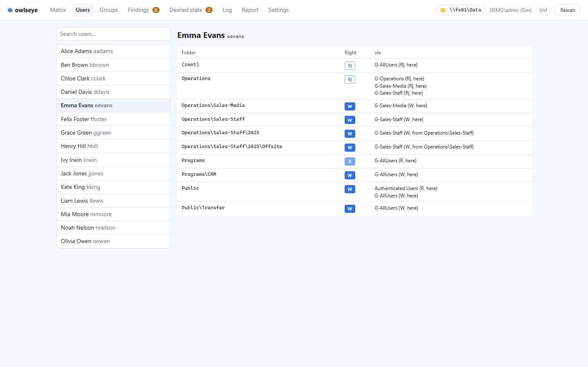

- Search by name or account; for the selected user: folder, effective right, and "via" (group, right, here or inherited
  from where) (F-V1, F-R6).

### 1.4 Who has access to one folder?

> As an admin, I want a page per folder with everyone who has access, its findings and its raw ACL, so that I can check a
> single folder completely.

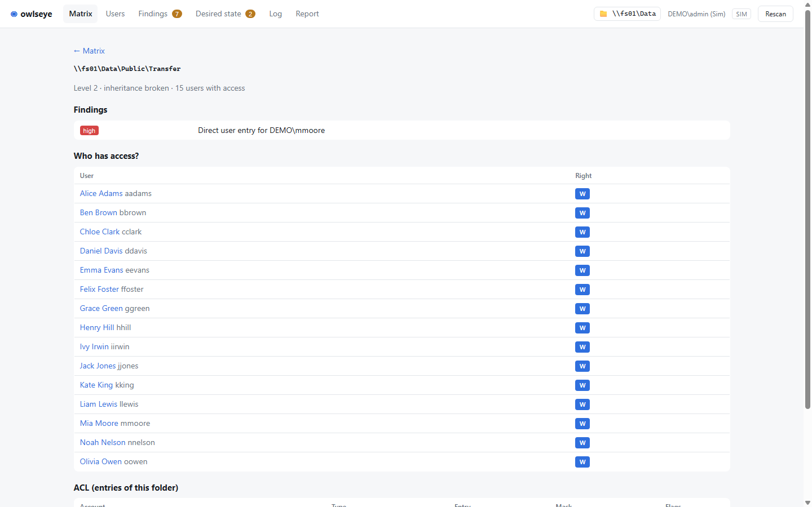

- Users with access, sorted by right; findings of the folder; the explicit ACL with mask and flags (F-V2).

### 1.5 What does one group do, and who is in it?

> As an admin, I want to pick a group and see where it has rights and who is in it, directly or through nested groups,
> and to see all memberships at a glance, so that I can clean up groups and explain where access comes from.

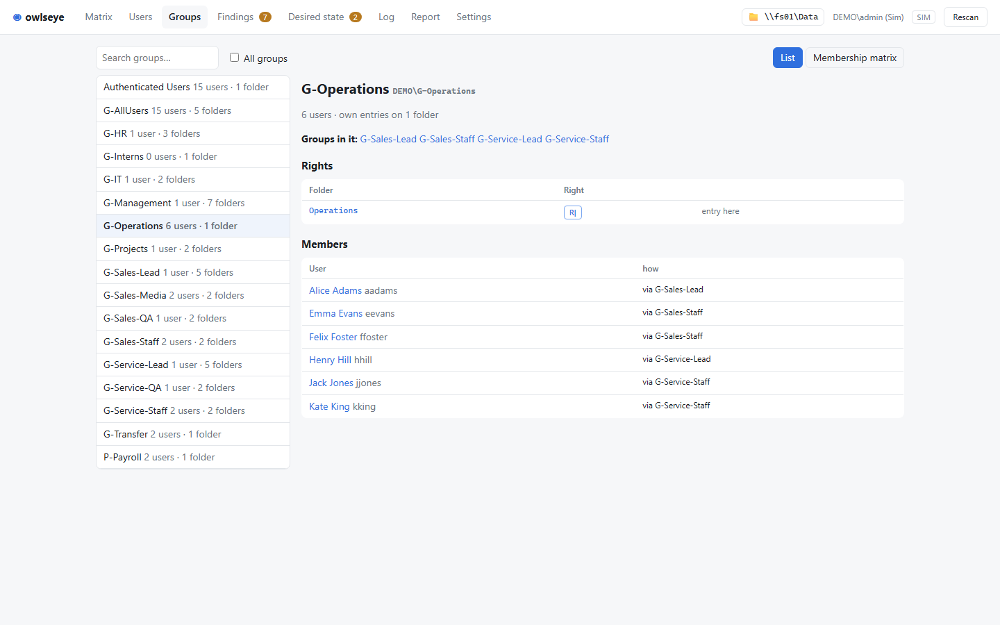

- **Groups** tab: the groups with rights on the share; "All groups" adds the groups nested in them. For the selected
  group: its rights (own entry or inherited), its members with "direct" or "via" the nested group, the groups in it
  and the groups it is in.
- **Membership matrix:** users × groups, ● direct member, ○ member through a nested group. Groups every user is in
  (Domain Users, Authenticated Users, an all-staff group) are named above instead of shown as full columns.

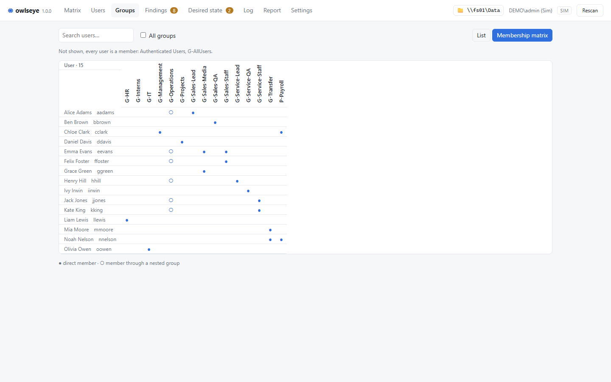

---

## 2. Change rights

### 2.1 Set a right by click or keyboard

> As an admin, I want to set or remove a right with one click or key, so that I can work through a list of requests
> quickly.

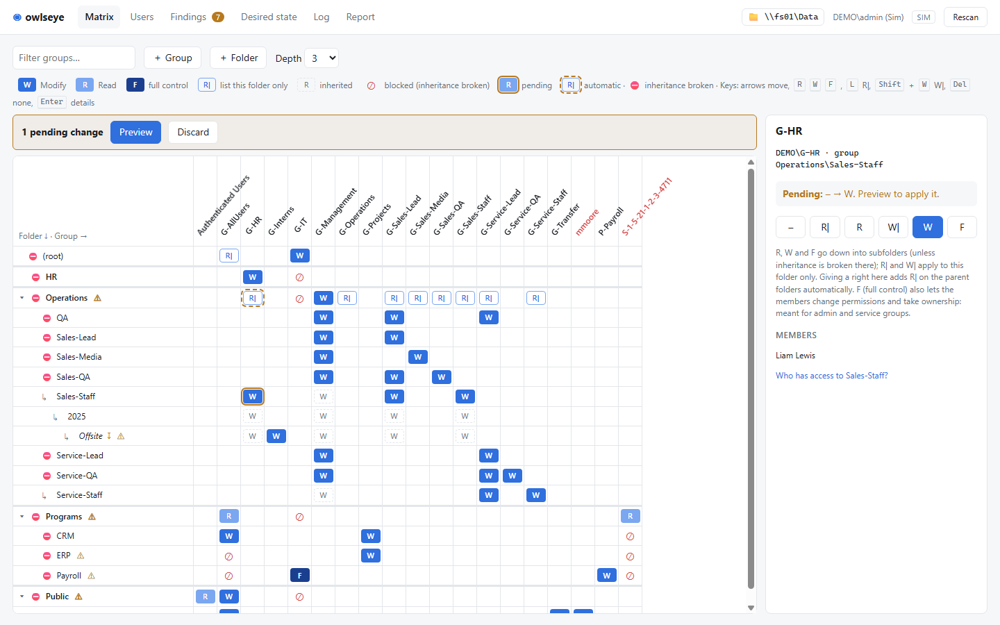

- In the panel: `–`, `R|`, `R`, `W|`, `W`. On a focused cell: `R`, `W`, `L` (R|), `Shift`+`W` (W|), `Del` (none);
  arrows move like in a spreadsheet; the focus stays on the cell (F-E1, F-E3).
- Changes are pending (orange outline) until applied; "Discard" drops them all (F-M8, F-E6).
- A change the planner refuses is reverted and the panel says why (F-E2).

### 2.2 Parent folders are opened automatically

> As an admin, I want owlseye to add "list this folder" (R|) on the parent folders when I give a group a right deep
> down, and to remove it again when the last right below goes, so that members can actually reach their folder.

- R| is added only where the group cannot already get in (own entry, inherited, or all its members are covered by
  another group) and removed only if no other right of the group remains below; an R| set by hand stays (F-P7, F-P8).
- Automatic entries are marked (dashed orange) in the matrix and in the preview.

### 2.3 Inheritance and clean-up

> As an admin, I want to break or restore inheritance on a folder and to reset a folder to the default, so that I can
> restrict a subfolder and clean up old special cases.

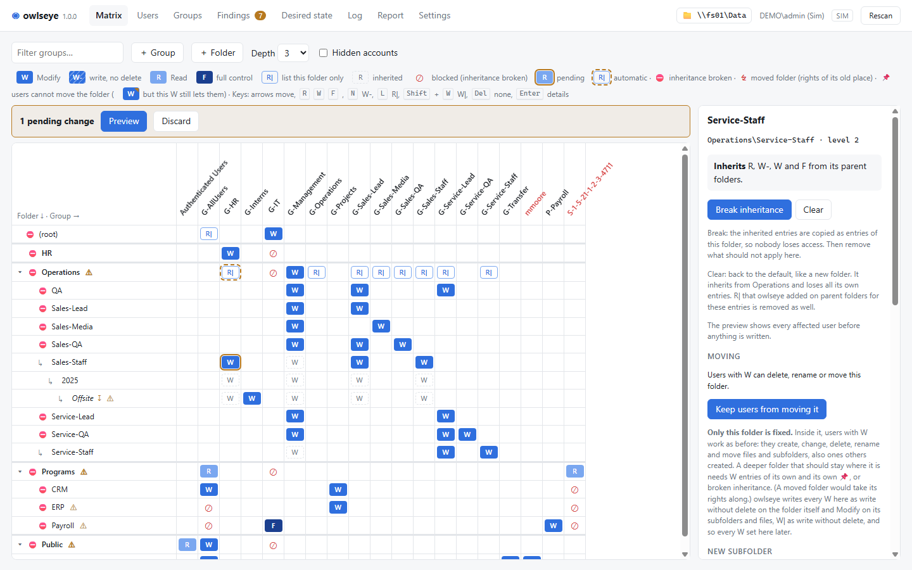

- Break: inherited entries become own entries, so nobody loses access; then remove what should not apply (F-P3).
- Restore: copies of what the parent passes down are removed (F-P4).
- Clear: inherits again, all own entries go (also deny and special entries), the automatic R| above too (F-I2, F-P11).
- On the root and on folders with broken inheritance the full-control accounts (by default SYSTEM and Administrators)
  keep full control (F-P9).
- The panel lists the hidden accounts on the folder and sets Creator Owner (what whoever creates a file or folder there
  gets): nothing, Modify or full control; full control is a finding (F-I3, F-I4, F-F1).

### 2.4 Create subfolders

> As an admin, I want to create subfolders and give them rights before they exist, so that a new team folder is set up
> in one step.

- Name checked (no reserved names, no trailing dot or space), only down to the matrix depth; parents first; the new
  folder inherits until rights are set (F-N1, S-5).

### 2.5 Give a new group rights

> As an admin, I want to add a group that has no entry in the share yet, so that I can give it its first right.

- "＋ Group" searches the directory by name prefix, plus the built-in groups (Users, Authenticated Users, Everyone, …
  also by their German names); SYSTEM and Administrators are explained instead of offered (F-G1, F-G2).

---

## 3. Change safely

### 3.1 Preview before writing

> As an admin, I want to see every ACL change and its effect on each user before anything is written, so that I do not
> lock anyone out by accident.

- Folders, entries before/after, automatic R|, new folders, and per user: right before → after (gained / lost) (F-A1).
- A reason or ticket number goes into the log.

### 3.2 Apply without overwriting someone else's change

> As an admin, I want owlseye to stop if an ACL was changed since I looked at it, so that I never overwrite a change made
> in Explorer in the meantime.

- Before writing, every affected ACL is read again; on a difference owlseye rescans and shows the new preview (F-A3).
- Writes go through a chain of handles: no junction can be slid in between check and write; folders with junctions below
  them are not written (S-1, S-3).
- Closing the window while ACLs are written asks first (F-B3).

### 3.3 Log and undo

> As an admin, I want every change logged with who, when, why and what, and to undo it, so that I can explain and revert
> what was done.

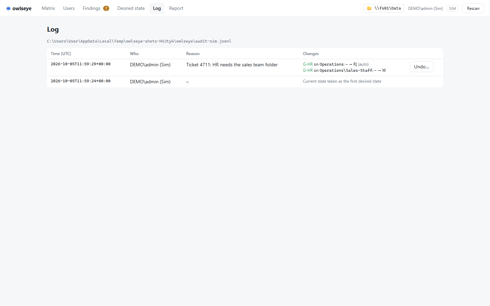

- The log (JSON Lines, can live on an admin share for several admins) lists each apply with its changes; an apply that
  was interrupted shows what was written and what not (F-L1, F-L2, D-4).
- "Undo…" puts the previous values into the matrix and opens the preview; created folders are not deleted (F-U1).

---

## 4. Keep the share as intended

### 4.1 Notice changes made outside owlseye

> As an admin, I want owlseye to tell me what was changed outside it (Explorer, icacls, scripts), so that the share does
> not drift away from what I set.

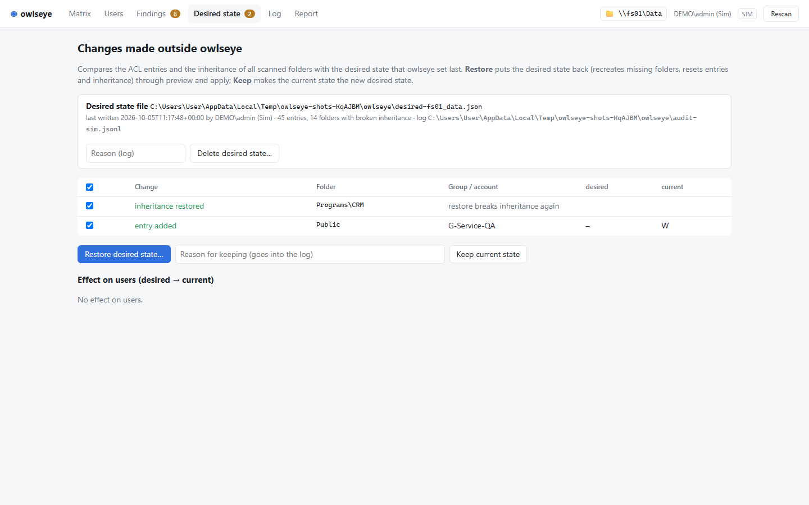

- owlseye keeps the desired state (cells and broken inheritance) per share; after every scan it lists added, removed and
  changed entries, inheritance changes and missing folders, with the effect on users (F-D1, F-D2, F-D8).
- A banner on the matrix and a badge in the menu point to it (F-M9).

### 4.2 Keep or restore

> As an admin, I want to either accept an outside change or put my desired state back, so that I decide what is right.

- Keep: the selected changes become the desired state, with a reason in the log (F-D4).
- Restore: the desired values become pending changes and go through preview and apply; missing folders are recreated
  (F-D6).
- Delete desired state: the current state becomes the desired state (F-D7).

### 4.3 Findings

> As an admin, I want a list of everything that does not fit the model, so that I can clean up old mess step by step.

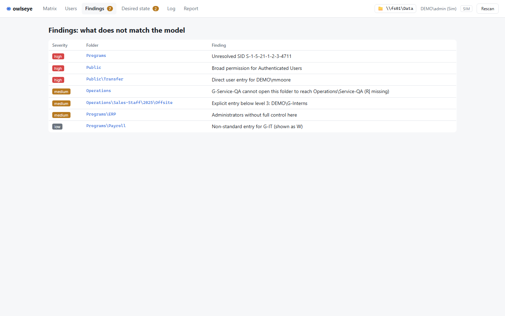

- Unreadable folders, unresolved SIDs, broad rights for Everyone/Authenticated Users, direct user entries, deny
  entries, entries or broken inheritance below the matrix depth, missing SYSTEM/Administrators, non-standard entries,
  groups that cannot reach their folder (R| missing), lookalike folder names (F-F1, S-6).

### 4.4 Prove who may do what (report)

> As an admin, I want a report of the access rights of a share as PDF and Excel, so that I can hand auditors and data
> protection officers evidence of who may read or write where, and what changed, without building an Excel list
> by hand.

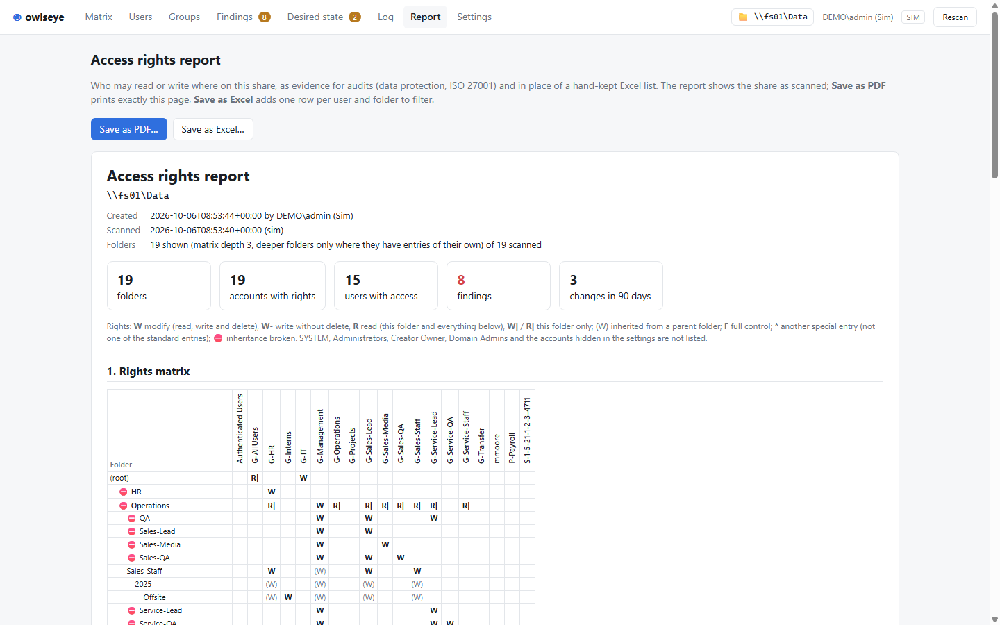

- "Report" in the menu shows the report for the share as scanned: summary (folders, accounts with rights, users with
  access, findings, changes), the rights matrix (own entries bold, inherited ones in brackets, broken inheritance
  marked), groups with their members, access per user, findings, and the changes of the last 90 days from the log
  with who, when, why. Pending changes are not part of it; the page says so.
- **Save as PDF** prints the page (A4 landscape, title and page numbers, each section on a new page; the matrix is split
  into blocks of 28 accounts so it fits the page width).
- **Save as Excel** writes a workbook with the sheets Summary, Matrix, Access (one row per user and folder with the right
  and the groups it comes through, to filter), Groups, Findings and Changes.
- A share with 2,000 folders, 60 groups and 300 users: built in under a second, the workbook (120,000 access rows) in
  about a second.

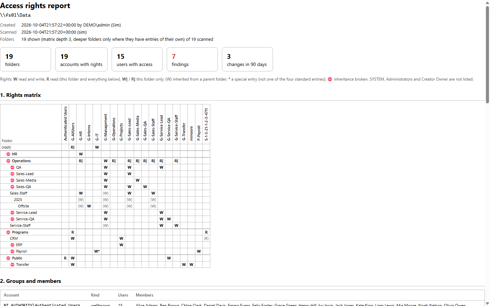

---

## 5. Run it

### 5.1 One folder, nothing to install

> As an admin, I want to start owlseye from a folder I copy to any Windows 10/11 machine, so that I do not need an
> installation or a server.

- The `publish` folder, about 75 MB: `owlseye.exe`, self-contained (.NET runtime and web assets inside), and six
  native libraries next to it; needs only the WebView2 runtime and says how to get it if it is missing (N-4).
- Nothing is extracted at run time. Run elevated, owlseye warns in the header if the folder is one that others than
  administrators can change (e.g. Downloads), since its libraries are loaded from there.
- No network listener; nothing but the window talks to the logic (N-3).

### 5.2 Open a share, remember it

> As an admin, I want to open a share by UNC path, mapped drive or folder picker, and find it again at the next start.

- A double-click on the exe opens the real thing, not the demo: AD and file server on a domain member, this machine's
  users and folders elsewhere (or what a `config.json` next to the exe says). The first start asks for the share.
- Header → share page: path field, "Browse…", recent shares; the last one opens at the next start (F-S3, F-S6, F-S9).
- If the share cannot be read, the window says why and offers another folder (F-S8).

### 5.3 Rights without a separate admin account

> As an admin, I want owlseye to start normally (so my mapped drives are visible) and to restart elevated only when the
> local mode needs it.

- Starts as the invoking user; in local mode "Restart as administrator" in the header (N-5).

### 5.4 Try it without a domain

> As an admin or developer, I want to try owlseye on demo data, an emulated domain or a local folder, so that I can learn
> it and test changes without touching a real file server.

- `--demo` (in memory), `--sim DIR` (emulated AD and real folder tree; edit `state.json` to simulate outside changes),
  `--local PATH` (this machine's groups and real ACLs), `seed-local PATH` (creates the demo share for that) (F-S1, F-X1–F-X3).
- Without a share yet, the start page offers to open the demo data (restarts owlseye with `--demo`).

### 5.5 Dark or light

> As an admin, I want owlseye to follow the Windows colour scheme.

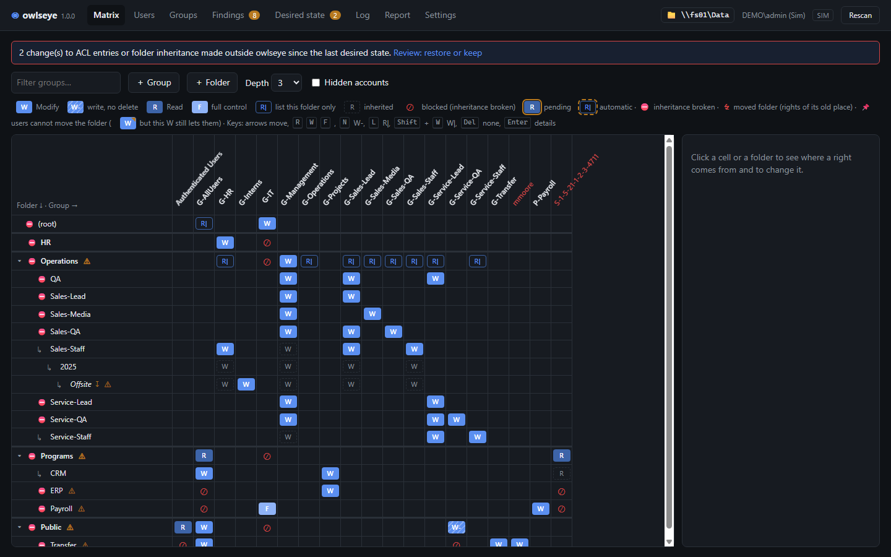

---

## Not covered yet

- Writing against a real domain is not tested in a lab yet (see the README).
- The exe is not signed.
